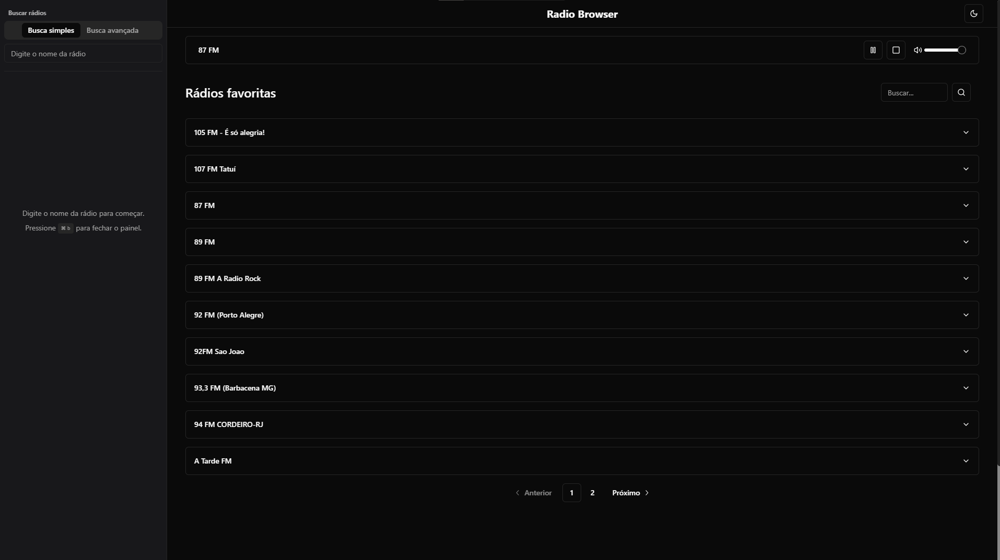
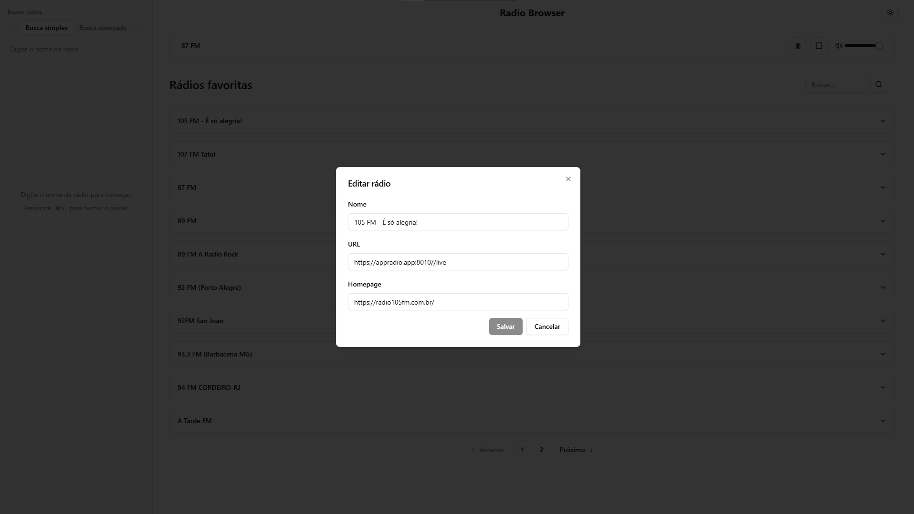
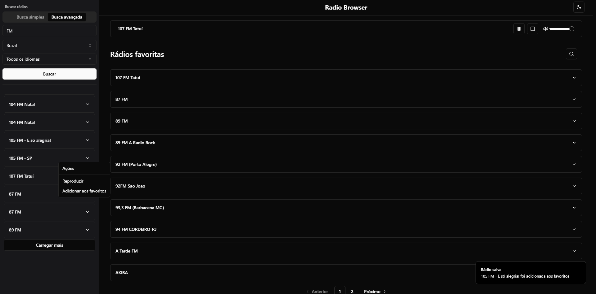
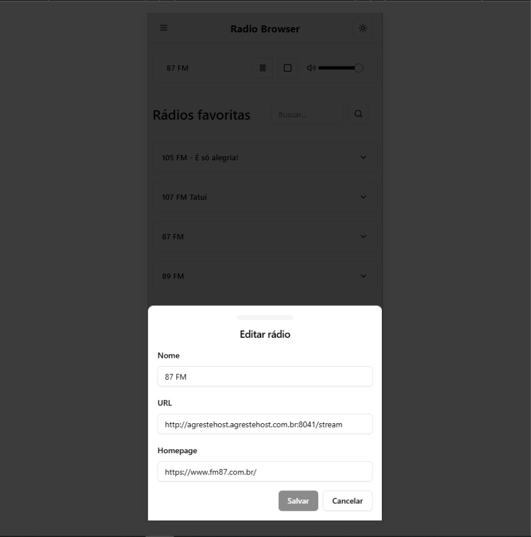
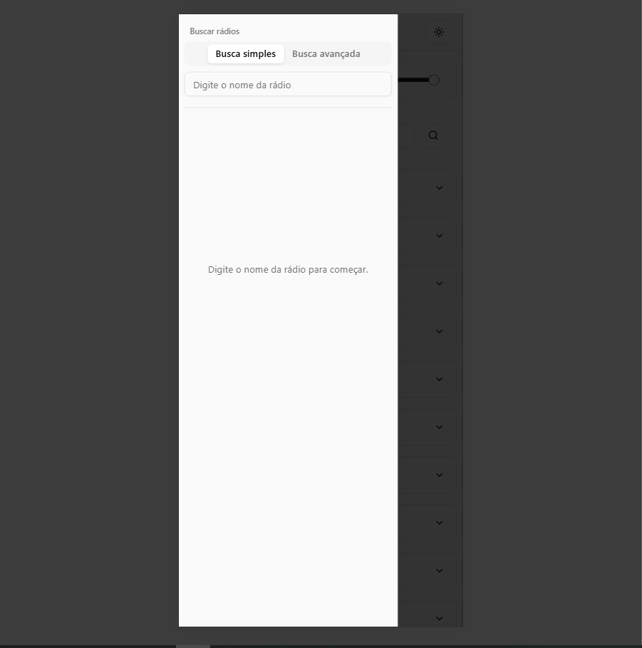
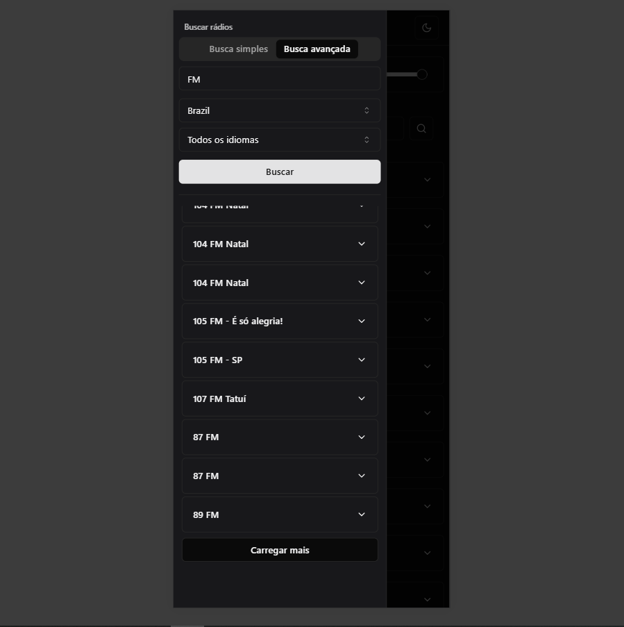

# Radio Browser

## Sobre o Projeto

Uma aplicação web para descobrir e gerenciar estações de rádio online, permitindo aos usuários explorar uma vasta coleção de rádios de todo o mundo.

## Deploy

Acesse a aplicação em produção: [Radio Browser App](https://radio-browser-app.vercel.app)

## Casos de Uso

- Usuários podem pesquisar rádios por nome, país ou idioma
- Usuários podem adicionar rádios aos favoritos
- Usuários podem visualizar sua lista de rádios favoritas
- Usuários podem remover rádios da lista de favoritos
- Usuários podem editar informações das rádios favoritas
- Usuários podem reproduzir as rádios diretamente na aplicação
- Usuários podem controlar o volume da reprodução
- Usuários podem alternar entre tema claro e escuro

## Screenshots

### Desktop




### Mobile





## Tecnologias Utilizadas

### Core
- React
- TypeScript
- Vite
- TailwindCSS

### UI
- Radix UI
- Shadcn/ui
- Lucide Icons
- Sonner (toasts)
- Vaul (drawers)

### Testes
- Vitest
- Testing Library

### Outros
- Husky (git hooks)
- ESLint
- Docker

## Como Executar

### Pré-requisitos
- Node.js 20+
- npm ou yarn

### Configuração do Ambiente

1. Clone o repositório:
```bash
git clone https://github.com/afraniocaires/radio-browser.git
```

2. Instale as dependências:
```bash
cd radio-browser
npm install
```

3. Configure as variáveis de ambiente:
```bash
cp .env.example .env
```

Nota: Como utilizamos uma API pública, não é necessário configurar nenhuma variável adicional. O arquivo .env.example já contém todas as configurações necessárias.

### Executando o Projeto

Desenvolvimento:
```bash
npm run dev
```

Build de produção:
```bash
npm run build
npm run preview
```

Testes:
```bash
npm run test
```

### Docker

Para executar com Docker:
```bash
docker build -t radio-browser .
docker run -p 80:80 radio-browser
```

## Estrutura do Projeto

- /src
  - /components - Componentes React reutilizáveis
    - /ui - Componentes primitivos de interface (botões, inputs, selects)
  - /contexts - Contextos React para gerenciamento de estado
  - /hooks - Hooks personalizados
  - /interfaces - Tipos TypeScript
  - /services - Serviços e integrações com APIs
  - /lib - Utilitários e funções auxiliares

## API

O projeto utiliza a API pública do Radio Browser:
- Base URL: https://de1.api.radio-browser.info
- Documentação: [Radio Browser API](https://api.radio-browser.info/)

## Testes

O projeto inclui testes unitários e de integração utilizando Vitest e Testing Library. Os testes podem ser executados com:

```bash
npm run test
```

> This is a challenge by [Coodesh](https://coodesh.com/)
